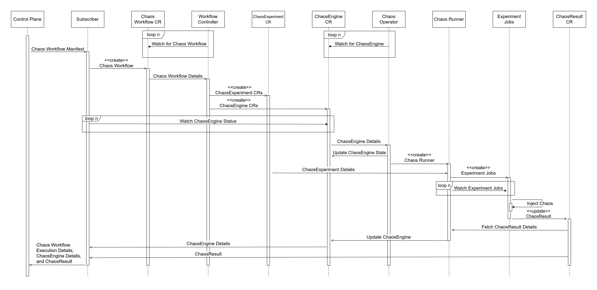
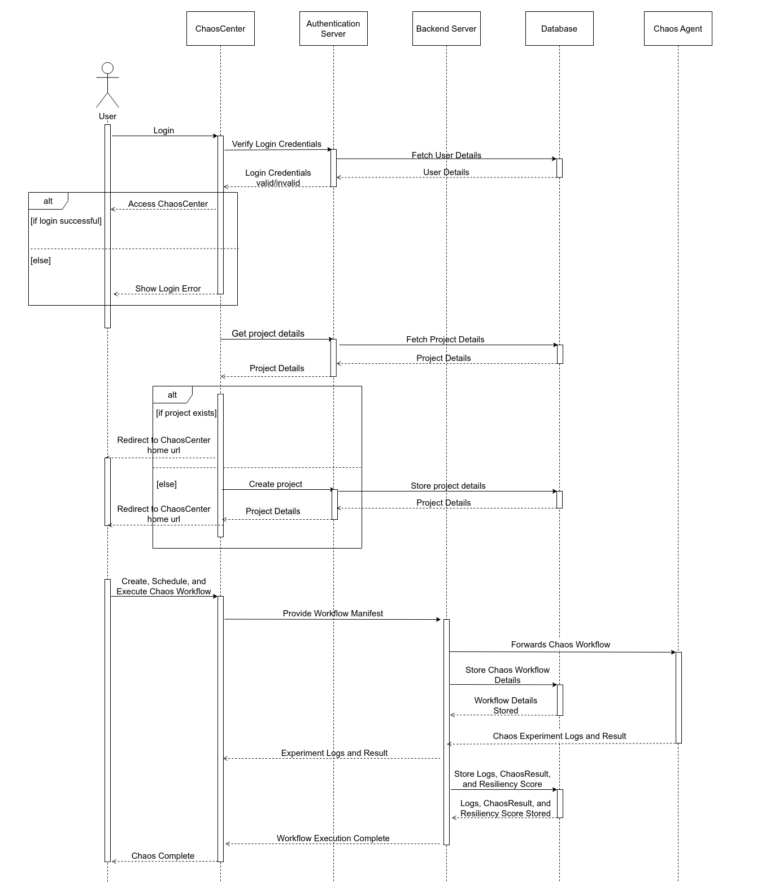

# Hands-On Chaos Engineering Workshop with LitmusChaos and the Road to CNCF Graduation - Shubham Chaudhary, Namkyu Park, Saranya Jena and Sayan Mondal

Link: TBD

Join us for an immersive workshop on LitmusChaos, the CNCF-incubating chaos engineering framework, as we share our journey toward graduation. We'll cover our transition from Litmus v2 to v3, security audits, new plugins, and our contributions to documentation and mentorship. This session will provide insights into building a globally impactful open-source project, especially for those in sandbox or incubating stages.

In the second half, we’ll guide you through installing Litmus, running your first chaos experiment, and connecting your ChaosHub. We’ll explore how to create custom experiments using the Litmus SDK, encouraging participants to suggest and test their own chaos scenarios. Bring Your Own Chaos (BYOC) and let’s execute it together in real time. Don’t miss this interactive deep dive into chaos engineering!

### Tooling used

1. Prometheus
2. Litmuschaos
3. Kubernetes
4. Grafana

### Architecture

##### Chaos Injection and detection

Chaos Execution Plane contains the components responsible for orchestrating the chaos injection in the target resources. They get installed in either an external target cluster if an external chaos infrastructure is being used or in the host cluster containing the control plane if a self chaos infrastructure is being used. It can be further segregated into Litmus Chaos Infrastructure components and Litmus Backend Execution Infrastructure components.

##### Target Application

##### Chaos Control Plane

Chaos control plane consists of micro-services responsible for the functioning of the ChaosCenter, the website-based portal that can be used for interacting with Litmus, apart from the CLI. Chaos Plane facilitates the creation and scheduling of chaos experiments, system observability during the event of chaos, and post-processing and analysis of fault results.

