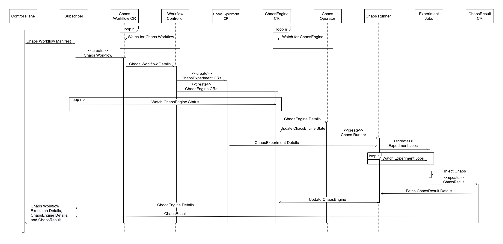
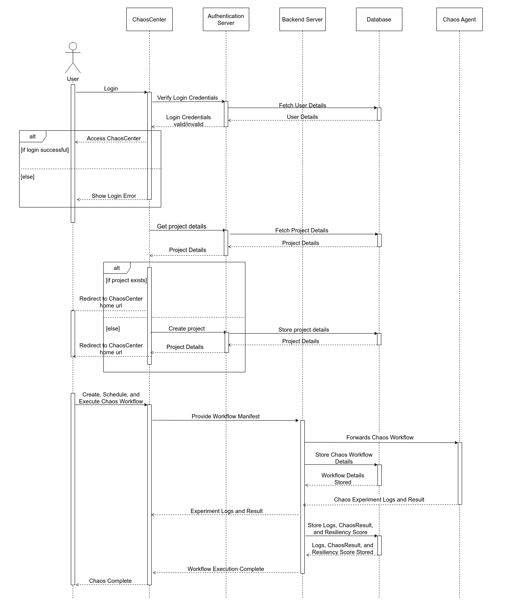

# Hands-On Chaos Engineering Workshop with LitmusChaos and the Road to CNCF Graduation - Shubham Chaudhary, Namkyu Park, Saranya Jena and Sayan Mondal

Link: TBD


Join us for an immersive workshop on LitmusChaos, the CNCF-incubating chaos engineering framework, as we share our journey toward graduation. We'll cover our transition from Litmus v2 to v3, security audits, new plugins, and our contributions to documentation and mentorship. This session will provide insights into building a globally impactful open-source project, especially for those in sandbox or incubating stages.

In the second half, we’ll guide you through installing Litmus, running your first chaos experiment, and connecting your ChaosHub. We’ll explore how to create custom experiments using the Litmus SDK, encouraging participants to suggest and test their own chaos scenarios. Bring Your Own Chaos (BYOC) and let’s execute it together in real time. Don’t miss this interactive deep dive into chaos engineering!

### Tooling used

1. Prometheus
2. Litmuschaos
3. Kubernetes
4. Grafana

### Architecture

##### Chaos Injection and detection

Chaos Execution Plane contains the components responsible for orchestrating the chaos injection in the target resources. They get installed in either an external target cluster if an external chaos infrastructure is being used or in the host cluster containing the control plane if a self chaos infrastructure is being used. It can be further segregated into Litmus Chaos Infrastructure components and Litmus Backend Execution Infrastructure components.



##### Target Application


##### Chaos Control Plane

Chaos control plane consists of micro-services responsible for the functioning of the ChaosCenter, the website-based portal that can be used for interacting with Litmus, apart from the CLI. Chaos Plane facilitates the creation and scheduling of chaos experiments, system observability during the event of chaos, and post-processing and analysis of fault results.



### Workshop: Designing Your Own Chaos Experiment

This guide provides a step-by-step process for creating custom chaos experiments using the Litmus SDK. The Litmus SDK simplifies the creation of experiments by scaffolding essential files in the appropriate directory based on input attributes provided by the chart developer. These scaffolded files act as templates and can be customized as required.

#### **Pre-Requisites**
- Ensure that Go is installed and the `GOPATH` environment variable is properly configured.

#### **Steps to Generate Experiment Manifests**

1. **Clone the Litmus-Go Repository**  
   Clone the repository and navigate to the `contribute/developer-guide` directory:

   ```bash
   git clone https://github.com/litmuschaos/litmus-go.git
   cd litmus-go/contribute/developer-guide
   ```

2. **Build the Litmus SDK**  
   Compile the SDK using the following command:

   ```bash
   go build -o ./litmus-sdk ./bin/main.go
   ```

3. **Define Experiment Attributes**  
   Populate the `attributes.yaml` file with the required details for your chaos experiment. Use `attributes.yaml.sample` as a reference.

   For example, to create an experiment targeting one replica of an NGINX deployment, the `attributes.yaml` may look as follows:

   ```yaml
   ---
   name: "sample-exec-chaos"
   version: "0.1.0"
   category: "sample-category"
   repository: "https://github.com/litmuschaos/litmus-go/tree/master/sample-category/sample-exec-chaos"
   community: "https://kubernetes.slack.com/messages/CNXNB0ZTN"
   description: "Executes commands inside target pods to inject chaos, waits for the specified duration, and reverts the chaos."
   keywords:
     - "pods"
     - "kubernetes"
     - "sample-category"
     - "exec"
   platforms:
     - Minikube
   scope: "Namespaced"
   auxiliaryappcheck: false
   permissions:
     - apigroups:
         - ""
         - "batch"
         - "apps"
         - "litmuschaos.io"
       resources:
         - "jobs"
         - "pods"
         - "pods/log"
         - "events"
         - "deployments"
         - "replicasets"
         - "pods/exec"
         - "chaosengines"
         - "chaosexperiments"
         - "chaosresults"
       verbs:
         - "create"
         - "list"
         - "get"
         - "patch"
         - "update"
         - "delete"
         - "deletecollection"
   maturity: "alpha"
   maintainers:
     - name: "ispeakc0de"
       email: "shubham@chaosnative.com" 
   provider:
     name: "ChaosNative"
   minkubernetesversion: "1.12.0"
   references:
     - name: Documentation
       url: "https://docs.litmuschaos.io/docs/getstarted/"
   ```

4. **Generate Experiment Artifacts**  
   Use the Litmus SDK to generate experiment artifacts based on the `attributes.yaml` file:

   ```bash
   ./litmus-sdk generate experiment -t exec -f=attributes.yaml
   ```

   **Supported Types (`-t` flag values):**
  - `exec`: Creates an exec-based chaoslib (default).
  - `helper`: Creates a helper-based chaoslib.
  - `aws`, `vmware`, `azure`, `gcp`: Creates platform-specific experiments.

5. **Customize the Experiment**  
   Modify the generated files to include desired behavior:
  - **Pre-Chaos Checks:** Add checks before chaos injection at the `@TODO: user PRE-CHAOS-CHECK` marker in `experiment/<name>.go`.
  - **Chaos Injection:** Modify chaos logic at the `@TODO: user INVOKE-CHAOSLIB` marker in `experiment/<name>.go`.
  - **Library Code:** Implement low-level execution in the `chaosLib/litmus/<name>/lib/<name>.go` file.
  - **Post-Chaos Checks:** Add checks after chaos injection at the `@TODO: user POST-CHAOS-CHECK` marker.

6. **Document the Experiment**  
   Create a README file explaining the purpose, details, and usage of the experiment. Save it as `experiments/<category>/<name>/README.md`.

7. **Generate Charts**  
   Once the experiment is complete, generate charts for submission to the Chaos Charts repository:

   ```bash
   ./litmus-sdk generate chart -f=attributes.yaml
   ```

#### **Connecting to ChaosHub**

You can link the Chaos Charts GitHub repository as a ChaosHub in your ChaosCenter. This integration allows you to access experiments via the ChaosCenter UI. Follow the instructions [here](https://docs.litmuschaos.io/docs/concepts/chaoshub#connecting-to-a-git-repository-using-chaoshub).

**Note:** You can refer to the [ispeakc0de/chaos-charts](https://github.com/ispeakc0de/chaos-charts/tree/byoc) repository for sample charts(byoc branch). This repository will be used to demonstrate the process of connecting to ChaosHub.

#### **Executing the Experiment**

Create and run the experiment by selecting it from the newly connected ChaosHub in the ChaosCenter UI.